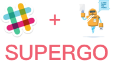

<p align="center">

</p>

## Description
hubot for slack

## Features

## Warning
**Token is any more useless where in package.json,Please use your own 🤪**

## Mapping
```js
|-- base/handlers           // shellcmd 脚本命令文件
|-- scripts                 // 注册入口
|-- src       
    |-- config              // 配置
    |-- scripts             // Hubot
        |-- base                // 封装
        |-- handler             // 执行入口
        |-- help                // 帮助
        |-- interval            // 定时器
        |-- service             // 服务
        |-- listener            // 路由监听
    |-- server              // 管理后台
    |-- include             // Hubot-Server Kit
    |-- view                // 管理后台 UI
```

## Run
```shell
    npm run dev
```
**or**
```
    docker build -f Dockerfile --build-arg HUBOT_SLACK_TOKEN_ARG=${YOUR HUBOT_SLACK_TOKEN} -t superbiger/supergo:0.0.1 .
    docker run --name supergo -p 8081:8081 -d superbiger/supergo:0.0.1
```
